# Autoplay - 基于计算机视觉的自动化控制系统

这是一个基于计算机视觉的自动化控制系统，通过捕获 OBS 虚拟摄像头画面，使用模板匹配识别目标位置，并向 Arduino 发送控制指令实现自动化操作。

## 系统流程图




## 项目结构

```
autoplay/
├── pyproject.toml          # uv/PEP 621 项目配置
├── uv.lock                 # uv锁文件（自动生成）
├── README.md
├── .gitignore
├── .python-version         # Python版本声明
├── config.yaml             # 应用配置文件
├── target.png              # 模板图像
├── target1.png
├── src/
│   └── autoplay/
│       ├── __init__.py
│       ├── main.py         # 程序入口
│       ├── config.py       # 配置加载与管理
│       ├── capture.py      # 视频捕获模块
│       ├── vision.py       # 图像处理模块
│       ├── arduino.py      # Arduino通信模块
│       ├── keyboard.py     # 键盘控制模块
│       └── logger.py       # 日志配置
└── tests/                  # 测试目录
    └── __init__.py
```

## 依赖管理

本项目使用 [uv](https://docs.astral.sh/uv/) 进行现代化的 Python 依赖管理。

### 安装 uv

```bash
curl -LsSf https://astral.sh/uv/install.sh | sh
```

### 安装依赖

```bash
uv sync
```

### 添加依赖

```bash
uv add <package-name>
```

### 添加开发依赖

```bash
uv add --dev <package-name>
```

## 配置

配置文件位于 `config.yaml`，包含以下配置项：

### 视频捕获配置

```yaml
capture:
  device_index: 1              # 摄像头索引
  width: 1920                  # 分辨率宽
  height: 1080                 # 分辨率高
  screenshot_interval: 2       # 截图间隔（秒）
  max_screenshots: 10          # 最大截图数量
```

### 存储配置

```yaml
storage:
  screenshot_dir: "~/Downloads/autoplay_screenshots"
  auto_cleanup: true           # 退出时自动清理
```

### 图像处理配置

```yaml
vision:
  template_path: "./target1.png"
  match_threshold: 0.2         # 模板匹配阈值
  scales_start: 1.0            # 缩放范围起始
  scales_end: 1.5              # 缩放范围结束
  scales_steps: 5              # 缩放步数
```

### Arduino 通信配置

```yaml
arduino:
  vid: "0x2341"                # 设备 VID
  pid: "0x006D"                # 设备 PID
  baudrate: 9600
  timeout: 1.0
  max_retries: 3               # 连接重试次数
  retry_delay: 0.5             # 重试间隔（秒）
```

### 键盘控制配置

```yaml
keyboard:
  exit_key: "esc"              # 退出按键
  movement_keys: ["w", "a", "s", "d"]
  action_keys: ["-", "f", "e", "r", "n"]
```

### 日志配置

```yaml
logging:
  level: "INFO"                # DEBUG/INFO/WARNING/ERROR
  format: "colored"            # colored/json/plain
  file: null                   # 日志文件路径，null 表示仅控制台
```

### 环境变量覆盖

配置可以通过环境变量覆盖，格式为 `AUTOPLAY__SECTION__KEY=value`。

例如：

```bash
export AUTOPLAY__CAPTURE__DEVICE_INDEX=0
export AUTOPLAY__LOGGING__LEVEL=DEBUG
```

## 使用

### 运行程序

```bash
uv run python -m autoplay
```

或：

```bash
uv run python src/autoplay/main.py
```

### 退出程序

按 `Esc` 键退出程序。

## 代码质量检查

### 类型检查

```bash
uv run mypy src/
```

### 代码风格检查

```bash
uv run ruff check src/
```

### 代码格式化

```bash
uv run ruff format src/
```

## 模块说明

### capture.py - 视频捕获模块

`VideoCapture` 类管理摄像头资源，支持上下文管理器自动释放资源。

### vision.py - 图像处理模块

`TargetDetector` 类使用多尺度模板匹配算法检测目标位置。

### arduino.py - Arduino 通信模块

`ArduinoController` 类管理 Arduino 串口连接，支持自动重试和连接复用。

### keyboard.py - 键盘控制模块

`KeyStateMachine` 类实现按键状态机，管理按键序列逻辑。

### config.py - 配置管理模块

使用 Pydantic 进行配置验证，支持 YAML 配置文件和环境变量覆盖。

### logger.py - 日志模块

使用 structlog 实现结构化日志，支持彩色输出和 JSON 格式。

## License

MIT License
